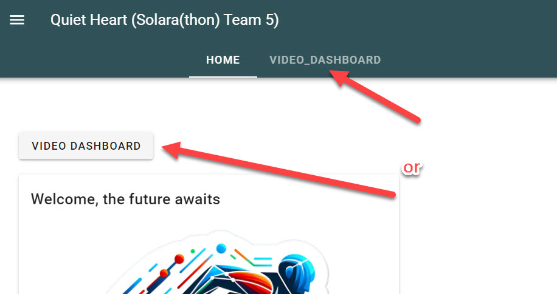
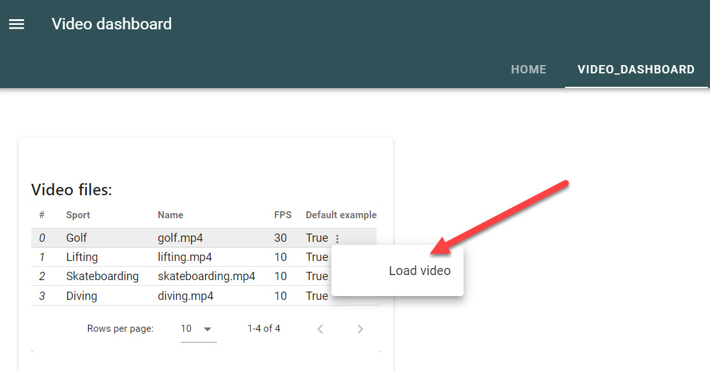
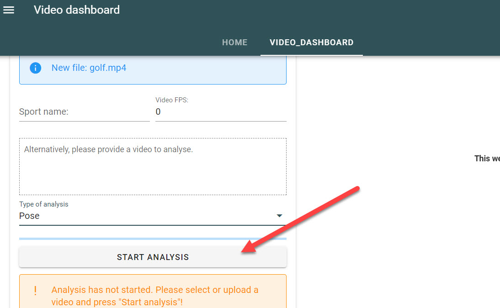

# Scenarios

## 1. Analyse video

### Select video tab

Press video the dashboard button or the video dashboard tab.

### Load predefined video

Select golf video to load via data table on the left.

### Process video with YOLO

Select type of analysis 'Pose' and push the 'Start analysis' button.

### Preview video

Once loaded the golf video will be available for preview.

